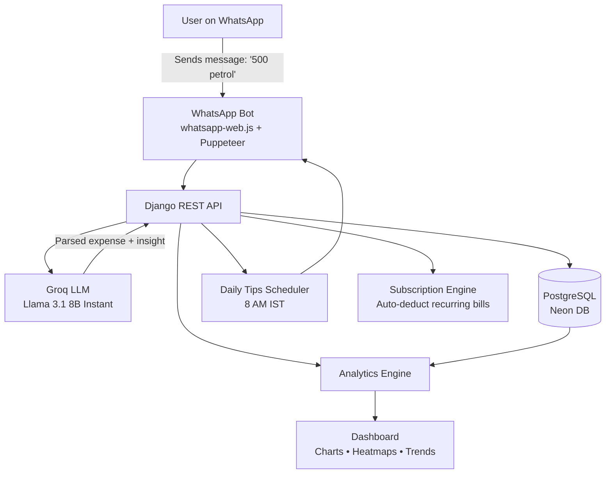
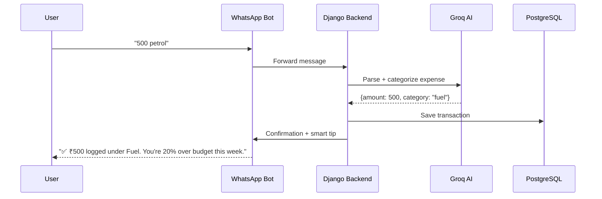

# 💸 ExpenseTracker — Smart Expense Coach


---

## 🌐 Live Website

Visit the live website here:

**🔗 https://ajay160380-paisa-mitra.hf.space**

Or simply click below:

[](https://ajay160380-paisa-mitra.hf.space)

---

<p align="center">
A premium AI-powered personal finance tracker with <b>WhatsApp integration</b>.<br/>
Track expenses via WhatsApp messages, get AI-powered spending insights, and manage your finances with a beautiful dark-themed dashboard.
</p>

<p align="center">
  
  
  
  
</p>

---

## ✨ Features

### 💬 WhatsApp & AI Core
| Feature | Description |
| :--- | :--- |
| 🤖 **WhatsApp Bot** | Track expenses by sending messages like *"500 petrol"* |
| 🧠 **AI Chat Coach** | Groq LLM-powered financial coach with Hinglish support |
| 🎙️ **Voice Expense** | Speech-to-expense via browser microphone |
| ☀️ **Daily Tips** | Personalized money-saving tips via WhatsApp (8 AM IST) |

### 📊 Money Management
| Feature | Description |
| :--- | :--- |
| 🚨 **Smart Alerts** | Budget warnings, spending spikes, category dominance |
| 🎯 **Savings Goals** | Set & track savings targets with progress tracking |
| 🤝 **Expense Splits** | Split bills with friends, auto-calculate settlements |
| 📅 **Monthly Comparison** | Compare spending with previous month |
| 🔁 **Subscription Engine** | Auto-deducts recurring bills on billing dates |

### 🎮 Engagement & Insights
| Feature | Description |
| :--- | :--- |
| 🏆 **Gamification** | XP, levels, streaks, badges, and quests |
| 📈 **Analytics Dashboard** | Charts, heatmaps, category breakdowns |
| 📤 **CSV/JSON Export** | One-click transaction history download |

---

## 🏗️ System Architecture



**Flow summary:**
1. User sends an expense message on WhatsApp (e.g. "500 petrol").
2. The bot forwards it to the Django backend.
3. Groq LLM parses the message into structured expense data and generates coaching insights.
4. Data is stored in PostgreSQL and reflected instantly on the analytics dashboard.
5. A scheduler sends daily money-saving tips back through WhatsApp every morning.

---

## 📊 Data Flow — Expense Lifecycle



---

## 🛠️ Tech Stack

- **Backend:** Django 6.0, Django REST Framework
- **AI:** Groq API (Llama 3.1 8B Instant)
- **WhatsApp:** whatsapp-web.js + Puppeteer
- **Database:** PostgreSQL (Neon)
- **Deployment:** Docker + Supervisor on HuggingFace Spaces

---

## 🚀 Local Setup

```bash
# 1. Clone
git clone https://github.com/ajay160380/-smart-expense-coach.git
cd -smart-expense-coach

# 2. Python setup
python3 -m venv env && source env/bin/activate
pip install -r requirements.txt

# 3. Node setup (for WhatsApp bot)
npm install

# 4. Environment variables
cp .env.example .env  # Edit with your keys

# 5. Database
python manage.py migrate

# 6. Run Django
python manage.py runserver

# 7. Run WhatsApp bot (separate terminal)
node bot.js
```

---

## 📄 License

This project is protected under a **proprietary, all-rights-reserved license** — see [LICENSE](LICENSE) for full terms.

> ⚠️ Viewing this repository does **not** grant permission to copy, modify, redistribute, or reuse this code — in whole or in part, with or without changes — in any personal, academic, or commercial project. This repository is shared publicly **for portfolio and evaluation purposes only**.

For collaboration or usage requests, contact the author directly.

---

## 📌 Author

**Ajay Vishwakarma**
- 🎓 B.Tech CSE (AI) — Babu Banarasi Das University (BBDU)
- 🌐 [Portfolio](https://ajay-portfolio-r176.onrender.com)
- 🐙 [GitHub](https://github.com/ajay160380)

Built with ❤️ using Django & AI.
